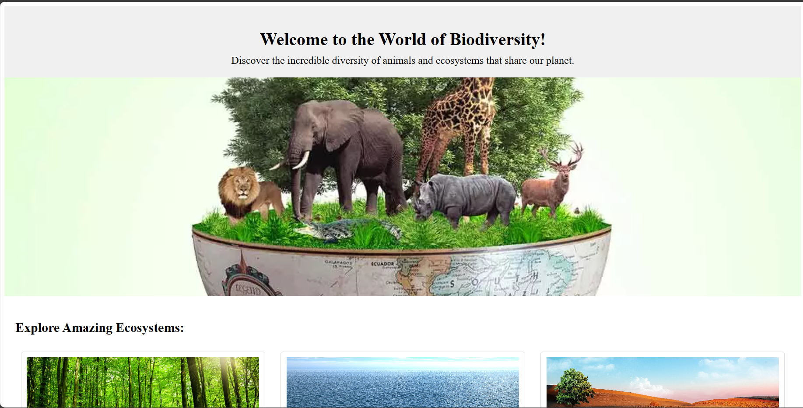
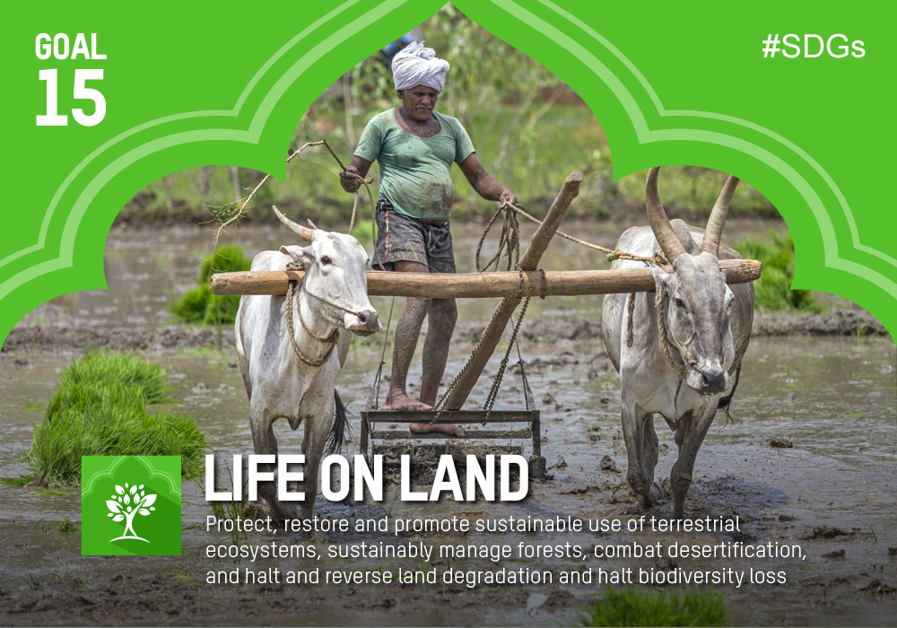

# Biodiversity

### The Symphony of Life: Biodiversity and its Critical Role in UN Goal Life on Land
Biodiversity, the tapestry woven from the intricate interconnections of all living things, lies at the very heart of our planet's health and our own well-being. This intricate web of life plays a vital role in maintaining crucial natural processes, from clean air and water to fertile soil and a stable climate. Recognizing its inherent value and crucial role in sustainable development, the *`United Nations enshrined "Life on Land" as Sustainable Development Goal 15 (SDG 15)`*, setting ambitious targets to combat land degradation, halt biodiversity loss, and sustainably manage forests. But why is biodiversity so important, and why is achieving SDG 15 critical for our future?

The *Tapestry of Life*: Diverse ecosystems, teeming with various species, act as nature's intricate machines. From rainforests regulating global climate to coral reefs protecting coastlines, each organism plays a specific role within its community. Bees pollinate our crops, fungi break down organic matter enriching soil, and countless organisms filter water and purify the air we breathe. This complex web of interactions ensures the smooth functioning of the natural world, providing us with essential ecosystem services we depend on for survival.

The *`Cost of Disruption`*: However, human activities like deforestation, unsustainable agriculture, and climate change are disrupting this delicate balance. The alarming rate of biodiversity loss threatens the very foundation of life on Earth. Species extinctions disrupt natural processes, leading to cascading effects across entire ecosystems. When pollinators disappear, food production declines. When forests vanish, floods and droughts become more frequent. The very foundations of our well-being and economic prosperity are undermined.

*`SDG 15: A Clarion Call for Action`: Recognizing the urgency of this crisis*, UN SDG 15 sets ambitious targets to combat land degradation, protect forests, and halt biodiversity loss by 2030. Achieving these targets requires a holistic approach, focusing on:

*Sustainable land management*: Implementing practices like crop rotation and agroforestry to protect soil health and maintain productive landscapes.
Forest conservation: Combating deforestation, restoring degraded forests, and promoting sustainable forestry practices.
Protected areas: Expanding and effectively managing protected areas to safeguard critical habitats for diverse species.
Combating climate change: Mitigating greenhouse gas emissions and adapting to climate impacts to protect ecosystems from further stress.
Embracing a Biodiverse Future: Achieving SDG 15 is not just an environmental imperative; it is a crucial investment in our collective future. By protecting biodiversity, we ensure the continued flow of ecosystem services, maintain food security, safeguard against natural disasters, and foster healthy communities. It is a call to action that requires active participation from individuals, governments, and businesses at all levels.

Ultimately, the fate of life on Earth lies in our hands. By embracing a more sustainable future, one that values and protects biodiversity, we can ensure a healthy planet for ourselves and generations to come. Let us listen to the silent symphony of life, understand its crucial role, and work together to weave a future where humanity and nature can thrive in harmony.

#### Project SetUp:

Ensure you have the LTS Version of node package manager (npm) installed into your system. Checkout this article https://docs.npmjs.com/downloading-and-installing-node-js-and-npm if not installed yet.

> cd biodiversity

> npm install

> ng serve